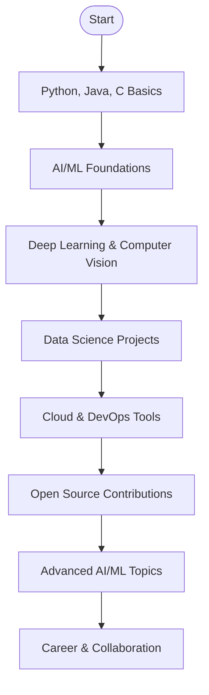

<!-- Profile Header with Badges -->
<p align="center">
  
</p>
<p align="center">
  
  <a href="mailto:sumansuhan1902@gmail.com"></a>
  <a href="https://www.linkedin.com/in/sumansuhan"></a>
  <a href="https://github.com/zaheerjk-coder"></a>
</p>

---

## 👨‍💻 About Me

```python
class SumanSuhan:
    def __init__(self):
        self.name = "Suman Suhan"
        self.role = "2nd Year AI/ML Student at Shetty Institute of Technology"
        self.location = "India"
        self.email = "sumansuhan1902@gmail.com"
        self.focus_areas = ["Artificial Intelligence", "Machine Learning", "Data Science"]
        self.interests = ["Computer Vision", "NLP", "Cloud Computing", "DevOps", "Open Source"]

    def connect(self):
        print("Let's connect and build something amazing together!")
```

---

## 🚀 Tech Stack & Tools

### 🛠️ Programming Languages


### 🤖 AI/ML Frameworks


### 📊 Data Science Tools


### ☁️ Cloud Platforms


### ⚙️ DevOps Tools


### 🗄️ Databases


### 🔧 Other Tools


---

## 📈 My Learning Journey



---

## 🎯 Current Focus

- Diving deeper into AI/ML research and real-world applications
- Building scalable data pipelines and deploying ML models on the cloud
- Contributing to open-source projects and hackathons
- Learning advanced DevOps for ML (MLOps) 🚀

---

## 🌱 Areas of Interest

- Computer Vision
- Natural Language Processing (NLP)
- Generative AI & LLMs
- Cloud-Native Machine Learning
- Automation & DevOps
- Technical Blogging & Knowledge Sharing

---

## 💼 Projects

- **Smart Attendance System**: Face recognition-based attendance management using OpenCV and TensorFlow
- **Sentiment Analyzer**: NLP app for social media sentiment classification
- **Data Pipeline Automation**: ETL automation with Python & Airflow
- **Cloud ML Deployment**: End-to-end ML model deployment on AWS/GCP

> *Explore more in my pinned repositories!*

---

## 🥅 Goals

- 🏆 Intern at a top tech company or AI startup
- 📚 Publish research in AI/ML journals
- 💡 Build products that make an impact
- 🌐 Grow my professional network and mentor others

---

## 📬 Let's Connect!

- 📧 [sumansuhan1902@gmail.com](mailto:sumansuhan1902@gmail.com)
- 💼 [LinkedIn](https://www.linkedin.com/in/sumansuhan)
- 🐙 [GitHub](https://github.com/zaheerjk-coder)

---

## 🌟 Fun Fact & Inspiration

> "The best way to predict the future is to invent it." — Alan Kay

---

<p align="center">
  
  
  
</p>

---

<!--
Modern, mobile-friendly, and recruiter-ready! Designed with ❤️ by Suman Suhan.
-->
